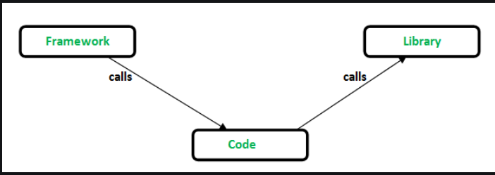

CDN(Content Delivery Network)
--It is a network of servers that delivers content to users. Both React and React-DOM are available over a CDN
--Why?-> Better Performance, Cost Saving, aster response and download time of content due to reduced latency, Additional Security including DDoS attack mitigation and SSL , Quick transfer of assets needed for loading Internet content

CrossOrigin Attribute in Script Tag
--CORS(Cross Origin Resource Sharing) is an HTTP header based mechanism that allows a server to indicate any cross origins(domain, scheme or port) other than it's own from which a browser should permit loading resources
--CrossOrigin attribute provide support for CORS. If we serve React from CDN , keep it in attribute set
--It indicates that the script should be loaded from a different origin

React.development.js vs React.production.js
--Different types of builds
--React application by default uses Webpack for production and development builds.

Library Vs Framework
--React is a library by Facebook,jQuery
--Angular  is a framework by Google,Vue
--Inversion of Control-> When we call a method from a library, we are in control. But in framework, the control is inverted i.e. the framework calls us. 

--Library takes minimum effort to put it into our code
--Library is easily replacable but frameworks aren't

Why React is known as React?
--Because it was designed to help developers "react" to changes in the state of an application , by efficiently rendering and updating the UI in response to those changes

Async vs Defer
--They are boolean attributes used with script tag to load the external scripts efficiently in webpage
--When we load a webpage
    - HTML parsing
    - Loading of Scripts -> fetching from network + executing line by line
--without async and defer, the parsing pauses when it encounters script tag, both occurs, then resumes-> not good

--async
   - the scripts are fetched asynchronously from network during HTML Parsing
   -then html parsing pauses, the execution occurs
   -the html parsing resumes
--defer
    -the scripts are fetched asynchronously from network during HTML Parsing 
    -execution only occurs when HTML parsing is finished
    -doesn't matter where script is available in browser , only executes after everything is finished

--async doesn't guarantee the order but defer does
    - so when we are using multiple script tags, which are dependant on each other , we shouldn't use async. use DEFER instead
-- when loading external scripts like google analytics script , use ASYNC

Arrow Function

